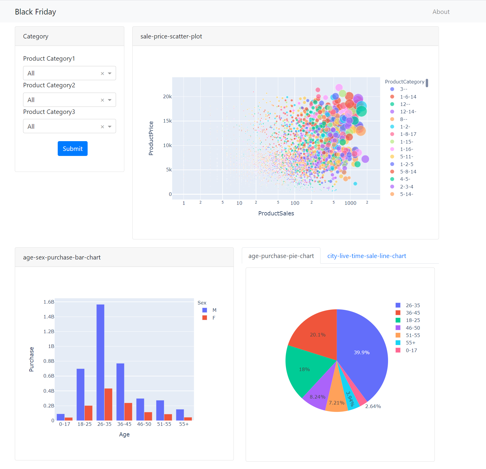
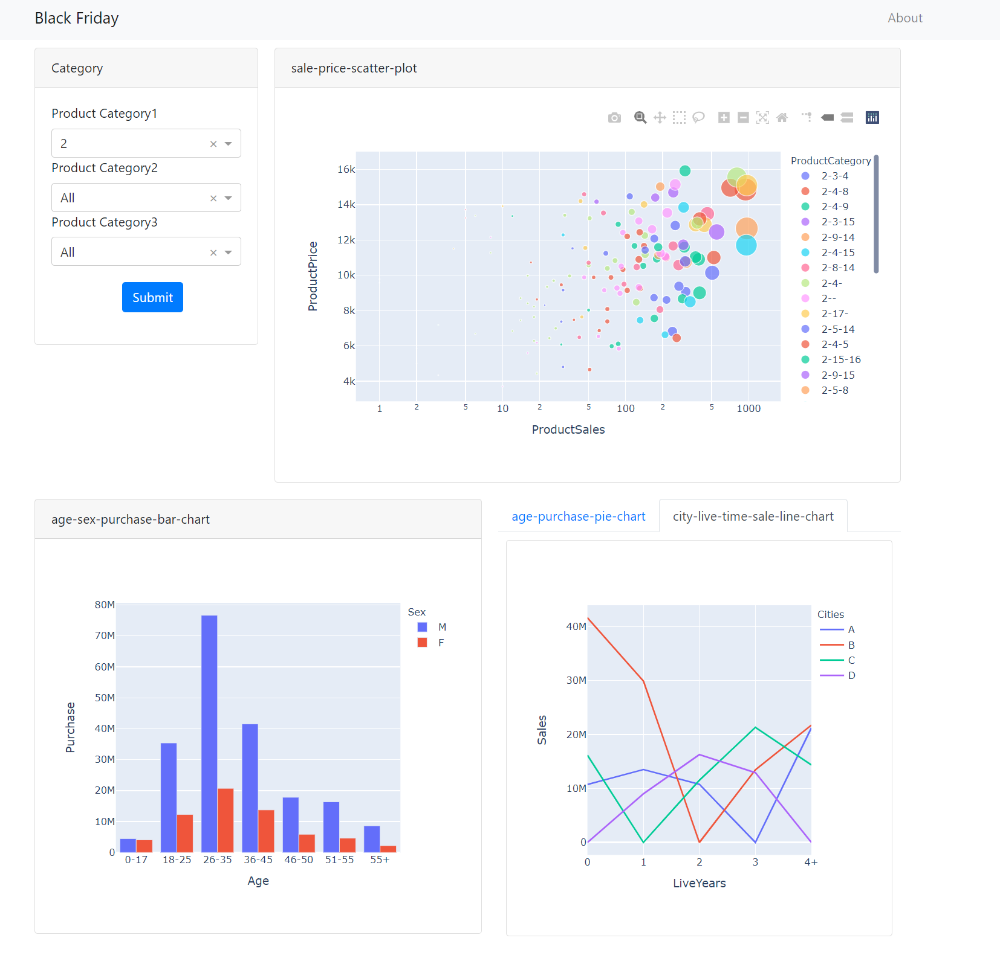

# Lab 3

### Development Environment

- **Development Environment:** Windows 10

- **Development Software:**

  1. **PyCharm** *PyCharm 2021.1.2 x64*

- **Development Language:**

   python 3.7

- **Mainly Reference Count:**

  1. dash(dash, dash_core_components, dash_html_components, dash_bootstrap_components)
  2. dash.dependencies (Input, Output, State)
  3. pandas
  4. plotly ( plotly.express )
  5. csv

### How to run

1. Install the necessary Python libraries

   list in [Development Environment](#Development Environment)

2. create path

   ```dataset\black-friday\BlackFriday.csv```

3. Start the server by running app.py

   ```
   python app.py
   ```

4. When the server starts, use the browser to access http://127.0.0.1:8050/

5. Select product categories.

6. Click submit button and wait for a moment.

7. Click tabs to change line chart and pie chart.

### Screen shots




