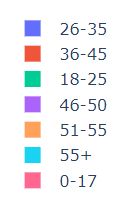
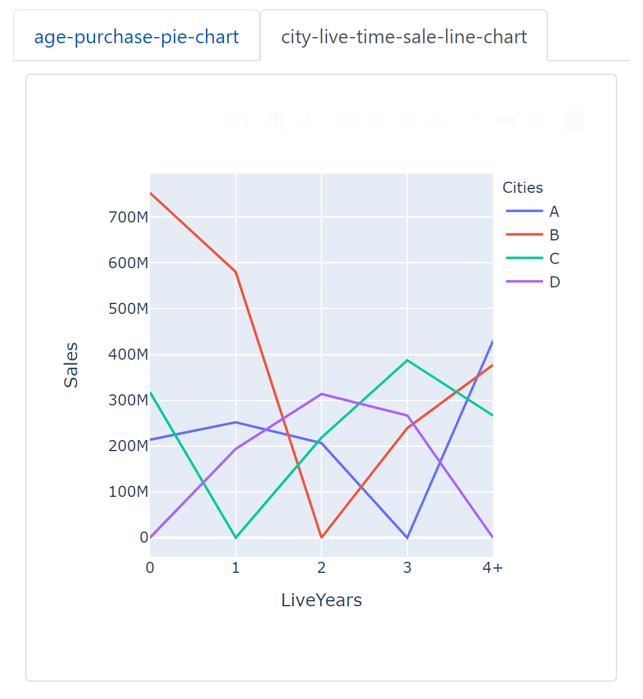

# Lab 3 Report

Black Friday

### Data analysis task for the chosen dataset 

#### Objectives

I use black Friday as the data set for this project. When I first got this dataset, I noticed that it was very large and it was slow to open with Excel. So my first idea is to sort the data. Thanks to its three categories, I classified the dataset.

In this data set, I want to know the relationship between gender and purchase amount; the relationship between age and purchase amount; the relationship between different cities and residential areas and purchase amount; the relationship between commodity price and commodity sales.

So I choose these tags in this csv file : ```User_ID```, ```Product_ID```, ```Gender```, ```Age```, ```City_Category```, ```Stay_In_Current_City_Years```, ```Product_Category_1```, ```Product_Category_2```, ```Product_Category_3```, ```Purchase```.

#### Characteristic

##### Categories

These products have three main categories, such as daily necessities, toiletries, toothbrushes, expressed in numbers. And each category has about eighteen tags.


So I use ```dcc.Dropdown``` to show all of it.

When you select a high-level tag, the low-level tag will be updated at the same time.


##### Gender

Man or Woman

I use a bar chart to show how much money people of the same age spend in different genders.


##### Age

```python
content_age_category = [
    '0-17', '18-25', '26-35',
    '36-45', '46-50', '51-55',
    '55+',
]
```

And I use the pie chart to show the consumption amount of people of different ages.



##### Cities and Years

This data set has people from four cities and years that people stay in this city.


I use a line chart to show the data.


##### Purchase

The purchase amount of a product for a user.


##### User ID

Corresponding to a user.

##### Product ID

Corresponding to a product.


##### Other

And there are some tags that i do not use in this dataset, like Marital_Status and Occupation.

### The layout of designed dashboard

First, I've listed the charts I need to use. They are scatter plot, pie chart, line chart and bar chart. Before I start drawing, I need to classify the data set. For the three categories of products, I use three ```dcc.Dropdown()``` components to classify the data displayed in the chart.

After classification, I begin to draw these charts powered by ```plotly.express``` and ```dash_core_components``` , such as ```dcc.Graph()``` 、```px.pie``` 、```px.line``` 、```px.scatter```、```px.bar``` . In this period, I just simply drew them, stacked them on the screen, and did not sort them out.

Then, I made a simple design of the interface on my iPad , and arranged the four charts and the category drop-down box.

Finally, I use ```dash_bootstrap_components``` to beautify my page. 


### The patterns revealed in the figures

I draw four graphs for this dataset.

1. Scatter plot

   

   

   In this picture, I want to find the relationship between the sales volume and the unit price of goods in the same commodity category.

2. Bar chart

   

   n this picture, I want to explore the purchasing power of the same age group and different gender on Black Friday

3. Pie chart

   

   

   In this picture, I want to explore the purchasing power of different age groups.

4. Line chart

   
   
   In this picture, I want to explore the influence of the same city and different residence time on the consumption of Black Friday.
   
   